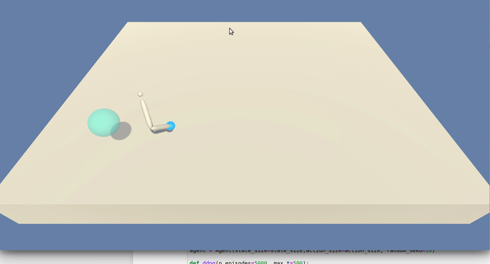
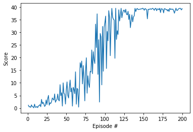
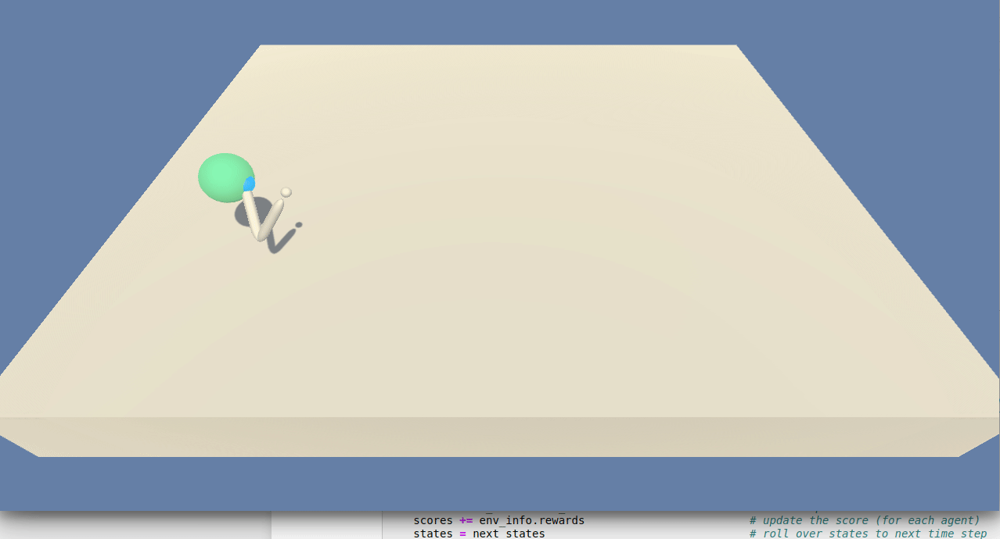

#Deep Reinforcement Learning: Project Navigation


I have explored the details from the [CONTINUOUS CONTROL WITH DEEP REINFORCEMENTLEARNING](https://arxiv.org/pdf/1509.02971.pdf) 
Then revisited the the Udacity repo [DDPG-Bipedal](https://github.com/udacity/deep-reinforcement-learning/tree/master/ddpg-bipedal) . Adapted the code from the repo, tried to tweak various hyperparameters. Solved the project on my GPU laptop.

###1. Started the Unity enviornment:
```
env = UnityEnvironment(file_name="./Reacher_Linux/Reacher.x86_64")
```
Environments contain brains which are responsible for deciding the actions of their associated agents. Here we check for the first brain available, and set it as the default brain we will be controlling from Python.

### 2. Examine the State and Action Spaces

In this environment, a double-jointed arm can move to target locations. A reward of `+0.1` is provided for each step that the agent's hand is in the goal location. Thus, the goal of your agent is to maintain its position at the target location for as many time steps as possible.

The observation space consists of `33` variables corresponding to position, rotation, velocity, and angular velocities of the arm.  Each action is a vector with four numbers, corresponding to torque applicable to two joints.  Every entry in the action vector must be a number between `-1` and `1`.

Run the code cell below to print some information about the environment.

### 3. Take Random Actions in the Environment

Explored how to use the Python API to control the agent and receive feedback from the environment. Watched the agent's performance, if it selects an action at random with each time step.

<p align=center></p>

### 3. Train the Agent with DDPG

The code consist of :

- `model.py` : Implement the Actor and the Critic classes.
    - The Actor and Critic classes each implements a *Target* and a *Local* Neural Networks used for the training.
    
- `ddpg_agent.py` : Implement the DDPG agent and a Replay Buffer memory used by the DDPG agent.
    
    - The `learn()` method updates the policy and value parameters using given batch of experience tuples.
        ```
        Q_targets = r + γ * critic_target(next_state, actor_target(next_state))
        where:
            actor_target(state) -> action
            critic_target(state, action) -> Q-value
        ```

###4.Model for agent and neural network
Agent Class was created in the dqn_agent.py file. It contains satic parameters as mentioned below:

- BUFFER_SIZE = int(1e6)  # replay buffer size
- BATCH_SIZE = 128        # minibatch size
- GAMMA = 0.99            # discount factor
- TAU = 1e-3              # for soft update of target parameters
- LR_ACTOR = 2e-4         # learning rate of the actor 
- LR_CRITIC = 2e-4        # learning rate of the critic
- WEIGHT_DECAY = 0.0001  # L2 weight decay

While training the agent tweaked some of the parameters. It was found that model is muchs  sensitive to the number of hidden units and learning rate. With hidden units of 400, 300 and 256 and with learning rate of more than 2e-4 model behaved slow ( Got score of 1 to 2 for first 100 episodes).

Batch size of 256 and 64 has not helped to speed up the training. Weight decay smaller than 0.0001 not only made training slower, but also considerably unstable. Sigma for noise also played cosiderable part in the training, sigma= 0.1 helped to make model more stable and faster as compared to sigma=0.2.

### 6. Deep Learning Model
Agent object was initialsed with state,action size and NN objects created for target and locat state-value function.
Agent class has step function which evaluates step value functions using deep learning models. Act fuction for the agent selects action for the given state. Action selection process also trained using the deep learning model and hence decoupled from the step-value evaluation.

The Actor Neural Networks use the following architecture :

- Input nodes (33) 
 - Fully Connected Layer (128 nodes, Relu activation) 
  - Batch Normlization
   - Fully Connected Layer (128 nodes, Relu activation) 
- Ouput nodes (4 nodes, tanh activation)

The Critic Neural Networks use the following architecture :

 - Input nodes (33) 
  - Fully Connected Layer (128 nodes, Relu activation) 
   -  Batch Normlization
   -  Include Actions at the second fully connected layer
   - Fully Connected Layer (128+4 nodes, Relu activation) 
   - Ouput node (1 node, no activation)
###Results

Environment solved in 200 episodes with an Average Score of 37.27

<p align=center></p>


### 4. Watch a Smart Agent!
Loaded the trained weights from saved file to watch a smart agent!
<p align=center></p>


